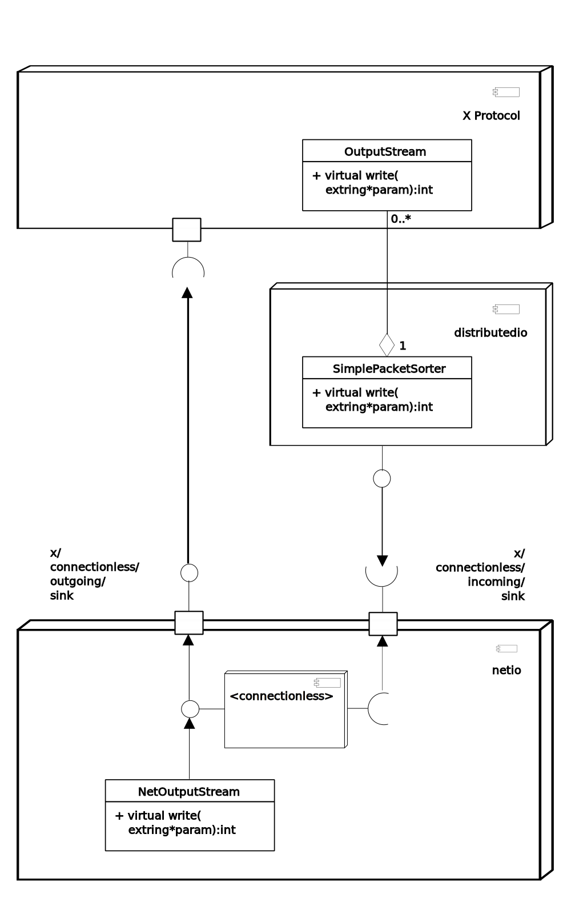

Router
========
Router module distributes incoming packets into different sinks based on an algorithm.

Diagrams
=========

The diagrams below shows the position of the distributedio in network implementation. Tipically SimplePacketSorter or it's subclass resides in between of lowlevel netio and higher order implementation. 

The following diagram shows the interworkings for connectionless sockets.

Readings
========
[Load balancer](http://aosabook.org/en/distsys.html#load_balancers)
[HAProxy](http://www.haproxy.org/)
