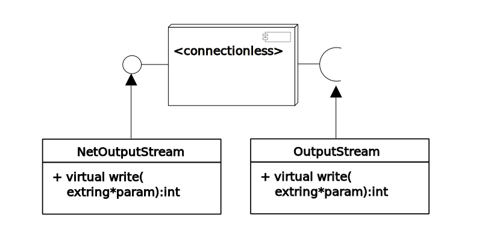
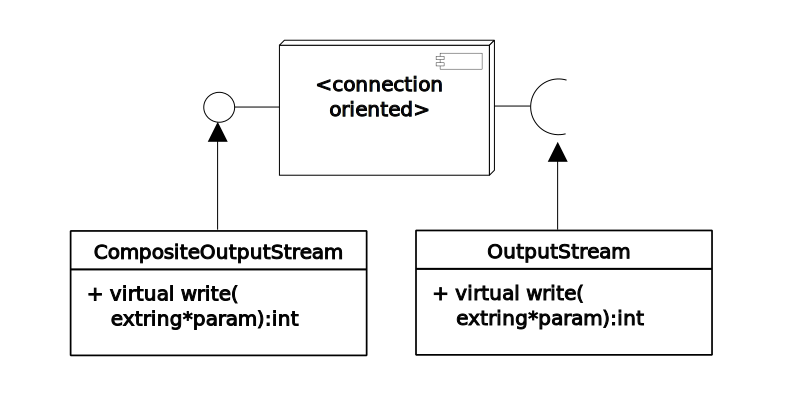

Netio is the decoupling module for networking. This module is statically linked. It has the following types of connections available.

- [Connectionless](vsrc/ConnectionlessPacketConveyorBelt.vala)
- [Connection oriented](vsrc/ConnectionOrientedPacketConveyorBelt.vala)

Opening a socket
=================





Data communication is done in sinks. These sinks are like gstreamer sinks. And these sinks are of OutputStream type. The sinks are created when the Connection conveyor-belt is created. For example, for http server the following code with listen for incoming connections.

```vala
extring laddr = extring.set_static_string("TCP://127.0.0.1:80");
extring stack = extring.set_static_string("http");
server = new ConnectionOrientedPacketConveyorBelt(&stack, &laddr);
server.registerAllHooks(this);
server.rehashHook(null,null);
```

Reading input data
===================

To read the data the reader need to register an input sink. For example, to read the data from http the following code registers a sink in the plugin.

```vala
HTTPRequestSink sync = new HTTPRequestSink();
extring entry = extring.set_static_string("http/connectionoriented/input/sink");
Plugin.register(&entry, new AnyInterfaceExtension(sync, this));
```

Each connection is identified by a token. The token is parsed from the packet.

```vala
token = pkt.char_at(0);
token = token << 8;
token |= pkt.char_at(1);
pkt.shift(2);
```

Writing out data
==================

Writing data is done in sinks in the opposite way of reading. These sinks are like gstreamer sinks. The sink is registered as extension at the time it starts listening for data.

```vala
/**
 * This hook should be called after the socket is open and listening starts. Basically it is registered to be executed in 'onReadyAlter'.
 */
internal int rehashHook(extring*inmsg, extring*outmsg) {
	sink = null; /* This is the output sink, it is of type OutputStream */
	extring entry = extring.set_static_string("http/connectionoriented/output/sink"); /* This is the location of connection oriented output sink */
	Plugin.acceptVisitor(&entry, (x) => {
		sink = (OutputStream)x.getInterface(null);
	});
	return 0;
}
```

#### Writing data in connection oriented sink

Writing output needs to specify the connection token in each packet. If the socket is connection oriented then the sink is CompositeOutputStream. It is possible to derive OutputStream of specific connection.

```vala
OutputStream xsink = ((CompositeOutputStream)sink).getOutputStream(token); /* Get the output stream of the specific connection */
xsink.write(data);
```
It is also possible to write data in the following way as in connectionless socket.

#### Writing data in connectionless sink

In this case the connection token is put in a tag-header in the packet.

```vala
pkt.msg.data[0] = (aroop_uword8)((connectionToken >> 8) & 0xFF);
pkt.msg.data[1] = (aroop_uword8)(connectionToken & 0xFF);
// packet content is started after 2 bytes ..
// .....
// .....
extring p = extring();
pkt.getContentAs(&p);
sink.write(&p);
```

More
=====

The shotodol_web project uses the connection oriented server. The code is good starting point to write a new service.

Debugging
=========

Watchdog for netio is tagged with 20. So the watchdog can be addressed by 'watch -l 100 -tag 20' command.


